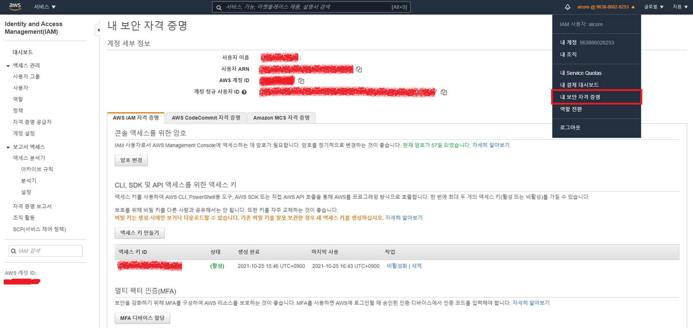
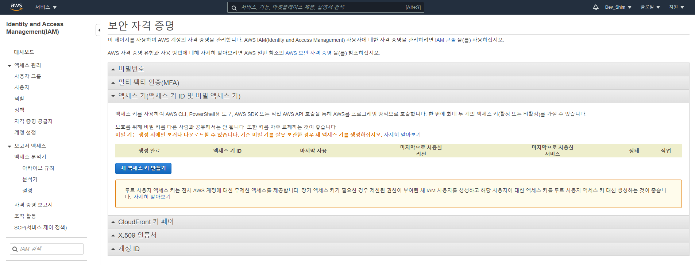

### EKS 설치 가이드 및 참고 사이트 링크

#### 1. aws CLI Version 2 설치
   * https://docs.aws.amazon.com/ko_kr/cli/latest/userguide/install-cliv2-linux.html 참고

   * 설치 파일 다운 및 진행 후 실행 권한 부여

   ```shell
   curl "https://awscli.amazonaws.com/awscli-exe-linux-x86_64.zip" -o "awscliv2.zip"
   unzip awscliv2.zip
   sudo ./aws/install
   
   (특정 버전 다운 시)
   curl "https://awscli.amazonaws.com/awscli-exe-linux-x86_64-2.0.30.zip" -o "awscliv2.zip"
   ```

   

#### 2. (기존에 Kubernetes 설치 시 3.으로) kubectl 설치
   * https://aws-eks-web-application.workshop.aws/ko/30-setting/500-eksctl.html 참고

   ```shell
   sudo curl -o /usr/local/bin/kubectl  \
      https://amazon-eks.s3.us-west-2.amazonaws.com/1.21.2/2021-07-05/bin/linux/amd64/kubectl
   
   sudo chmod +x /usr/local/bin/kubectl
   
   (설치 확인 명령)
   kubectl version --client=true --short=true
   
   ---------------------------------------------
   # 출력되는 결과 값
   Client Version: v1.21.2-13+d2965f0db10712
   
   # 수업 때 사용한 버전 값
   Client Version: v1.20.11
   ---------------------------------------------
   
   # kubectl 명령어 자동완성 스크립트 설치
   sudo yum install -y bash-completion
   ```

   

#### 3. eksctl 설치
   * https://docs.aws.amazon.com/ko_kr/eks/latest/userguide/eksctl.html 참고

   ```shell
   curl --silent --location "https://github.com/weaveworks/eksctl/releases/latest/download/eksctl_$(uname -s)_amd64.tar.gz" | tar xz -C /tmp
   
   sudo mv -v /tmp/eksctl /usr/local/bin
   
   (설치 확인 명령)
   eksctl version
   ```

   * eksctl zsh 명령어 자동 완성 기능 추가

   ```shell
   mkdir -p ~/.zsh/completion/
   eksctl completion zsh > ~/.zsh/completion/_eksctl
   
   (~/.zshrc 파일 안에 다음 내용 저장)
   fpath=($fpath ~/.zsh/completion)
   
   (다음 명령 실행)
   autoload -U compinit
   compinit
   ```

   

#### 4. AWS IAM 인증 설치
   * https://docs.aws.amazon.com/ko_kr/eks/latest/userguide/install-aws-iam-authenticator.html 참고

   (1) 설치 바이너리 파일 다운 (unzip 필요)

   ```shell
   sudo apt install -y unzip
   
   curl -o aws-iam-authenticator https://amazon-eks.s3.us-west-2.amazonaws.com/1.19.6/2021-01-05/bin/linux/amd64/aws-iam-authenticator
   
   unzip aws-iam-authenticator
   ```

   (2) aws-iam-authenticator 바이너리 파일에 실행 권한 부여

   ```shell
   chmod +x ./aws-iam-authenticator
   ```

   (3) 바이너리 $PATH 폴더에 복사 빛 환경 변수 추가

   ```shell
   mkdir -p $HOME/bin && cp ./aws-iam-authenticator $HOME/bin/aws-iam-authenticator && export PATH=$PATH:$HOME/bin
   
   (bash쉘 사용 시) echo 'export PATH=$PATH:$HOME/bin' >> ~/.bashrc
   (z쉘 사용 시) echo 'export PATH=$PATH:$HOME/bin' >> ~/.zshrc
   ```

   (4) aws-iam-authenticator 바이너리 작동 테스트

   ```shell
   aws-iam-authenticator help
   ```

   (5) aws configure로 IAM 인증 정보 등록

   ① 인증정보 생성 및 확인 메뉴

   

   ↓ 기존 액세스 키가 없을 시, ①의 메뉴는 하단 그림과 같이 나타난다.

   

   **※ 주의 - 인증정보 중 Secret Access Key는 생성 당시에만 확인 가능하며, 생성완료 시점에만 엑셀 파일로 다운 가능하다.**

   	

   ② ①에서 생성한 인증정보 등록 (입력창이 요소마다 한 단계씩 나타난다.)

   ```shell
   aws configure
   
   AWS Access Key ID [****************GIPZ]: Access Key ID 입력
   AWS Secret Access Key [****************DJFK]: Secret Access Key 입력
   Default region name [ap-northeast-2]: ap-northeast-2
   Default output format [json]: json
   ```

   ③ aws sts get-caller-identity 로 등록된 정보 확인 -> 등록한 정보가 아래와 같이 json 포맷으로 출력되면 OK

   ```shell
   aws sts get-caller-identity
   
   {
       "UserId": "~~~~~",
       "Account": "~~~~~",
       "Arn": "arn:aws:iam::~~~~~:~~~~~/~~~~~"
   }
   ```

   

#### 5. Amazon EKS 클러스터 생성
   * https://docs.aws.amazon.com/ko_kr/eks/latest/userguide/create-cluster.html 참고

   * < > 사이의 값은 구성하는 상황에 맞게 수정 및 입력!

   ```shell
   eksctl create cluster \
    --name <my-cluster> \
    --version <1.21> \
    --with-oidc \
    --without-nodegroup
    
   (수업 예시)
   eksctl create cluster --name mycluster --region ap-northeast-2 --version 1.20 \\n\t--nodegroup-name mynodegroup --nodes 2 --instance-types t3.medium --managed
   ```

   

#### 참고 링크
  * eksctl create cluster 공식 문서 -  https://eksctl.io/
  * eksctl cluster vpc setting 샘플 git - https://github.com/weaveworks/eksctl/blob/main/examples/04-existing-vpc.yaml
  * aws create cluster 공식 문서 - https://docs.aws.amazon.com/eks/latest/userguide/create-kubeconfig.html
  * AWS 클러스터 워크샵 공식문서 - https://aws-eks-web-application.workshop.aws/ko/10-intro.html
  * [Kubernetes] AWS EKS Cluster 생성 샘플 - https://velog.io/@winz/Kubernetes-AWS-EKS-Cluster-%EC%83%9D%EC%84%B1#kubectl-%EC%97%90-%EC%83%9D%EC%84%B1%ED%95%9C-eks-%EB%A5%BC-%EC%97%B0%EA%B2%B0

```toc

```