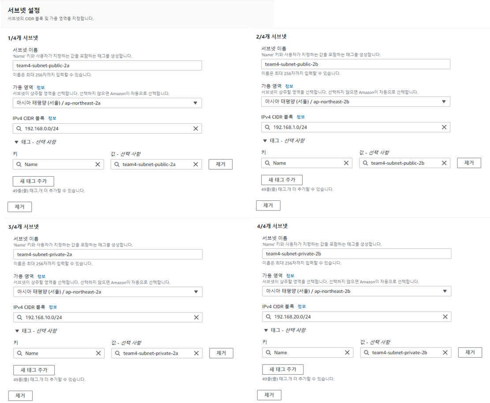

* 들어가기 앞서 진행 중에 필요에 따라 수정이 있었기에, **각 이미지의 태그이름 및 구성 정보가 글내용과 정확히 일치 않는다는 점 유의**.

  

### * 네트워크 아키텍쳐


---

#### 1. VPC 생성

​	1) 이름 지정 및 IPv4 CIDR 지정
  - CIDR : 192.168.0.0/16

  

---

#### 2. Subnet 구성

​	1)서브넷 생성
- 2a용 public, private 각 1개
- 2b용 public, private 각 1개



(1) subnet-public-2a : 192.168.0.0/24  |  subnet-private-2a : 192.168.10.0/24

(2) subnet-public-2b : 192.168.1.0/24  |  subnet-private-2b : 192.168.20.0/24

---


#### 3. 인터넷 게이트웨이 생성

* 이름 지정하여 생성 후, 우측 상단 작업 → VPC에 연결 → 1) 에서 생성한 VPC로 연결


---


#### 4. 라우팅 테이블 생성

  - 1.에서 생성한 vpc를 지정


---


#### 5. 라우팅 테이블에 게이트웨이, public subnet 연결

​	1) 3.에서 생성한 게이트웨이 추가


​	2) 2.에서 생성한 public subnet 2개 연결(2a, 2b의 public Subnet)


---


#### 6. NAT 게이트웨이 생성 2개 생성

* ap-northeast-2a / ap-northeast-2c 각기 1개씩 생성.

  (1) 2A용 게이트웨이는 Public-2A 서브넷 / 2C용 게이트웨이는 Public-2C 서브넷 선택 후 생성.
  
  (2) 탄력적 IP는 없을 경우 할당으로 생성.


---

#### 7. Private Subnet을 할당할 라우팅 테이블 생성

* Private A / Private C 각기 라우팅 테이블을 생성.

  (1) 1.의 VPC를 선택하여 새로운 라우팅 테이블 생성 후, 라우팅 편집으로 6)에서 생성한 NAT 게이트웨이를 지정.
  
  * 2A용 라우팅테이블엔 2A용 NAT를 연결
  * 2C용 라우팅테이블엔 2C용 NAT를 연결


  


  (2) 각 라우팅 테이블과 Private Subnet을 연결한다.

  - Private-2A용 라우팅 테이블의 서브넷 연결


  - Private-2C용 라우팅 테이블의 서브넷 연결


```toc
```


