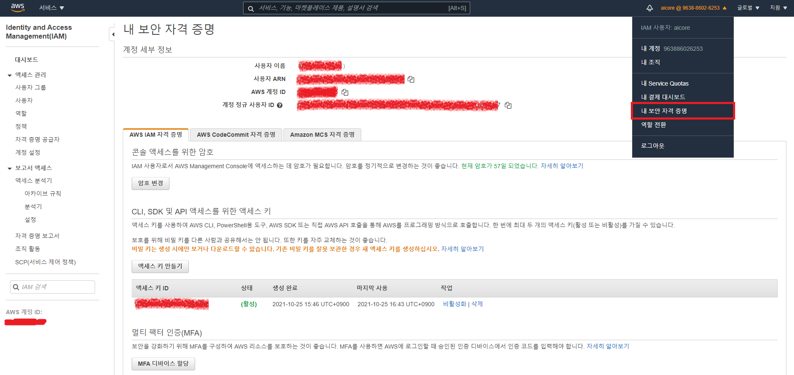

### Bastion Host 역할용 인스턴스 생성 후, 설정 가이드

#### 1. apt 패키지 업데이트 및 시간대 설정

```bash
sudo -i
apt-get update

-------------------------
(Centos, Ubuntu 공통)
sudo timedatectl list-timezonex | grep -i Asia/Seoul

sudo timedatectl set-timezone Asia/Seoul
date

-------------------------
(ubuntu)
dpkg-reconfigure tzdata
-> Asia
-> Seoul 차례대로 선택

date
```

---

#### 2. kubernetes 설치에 필요한 패키지 및 기타 패키지 설치 진행

```bash
sudo apt-get install -y apt-transport-https ca-certificates curl python3-pip
```

---

> zsh를 사용하지 않을 사람이라면  3. 과정은 스킵

#### 3. oh my zsh 설치

```bash
sudo apt install -y zsh
sh -c "$(curl -fsSL https://raw.githubusercontent.com/ohmyzsh/ohmyzsh/master/tools/install.sh)"
```

(1) Powerlevel10k 테마

```bash
git clone --depth=1 https://github.com/romkatv/powerlevel10k.git ${ZSH_CUSTOM:-$HOME/.oh-my-zsh/custom}/themes/powerlevel10k
```

```bash
(~/.zshrc 파일에서 ZSH_THEME 내용 수정)
ZSH_THEME="powerlevel10k/powerlevel10k"
```


(2) autoupdate 플러그인

```bash
git clone https://github.com/TamCore/autoupdate-oh-my-zsh-plugins ${ZSH_CUSTOM:-~/.oh-my-zsh/custom}/plugins/autoupdate
```

```bash
~/.zshrc -> plugins=(~~ autoupdate)  autoupdate 내용 추가
```


(3) zsh-syntax-highlighting 플러그인

```bash
git clone https://github.com/zsh-users/zsh-syntax-highlighting.git ${ZSH_CUSTOM:-~/.oh-my-zsh/custom}/plugins/zsh-syntax-highlighting
```

```bash
~/.zshrc -> plugins=(~~ zsh-syntax-highlighting)  zsh-syntax-highlighting 내용 추가
```


(4) 접속 유저의 기본 쉘 변경

```bash
sudo vim /etc/passwd

ubuntu:x:1000:1000:Ubuntu:/home/ubuntu:/bin/bash
-> ubuntu:x:1000:1000:Ubuntu:/home/ubuntu:/bin/zsh
```

---

#### 4. AWS CLI 설치

```bash
sudo apt install -y zip
```

```bash
curl "https://awscli.amazonaws.com/awscli-exe-linux-x86_64.zip" -o "awscliv2.zip"
```

```bash
unzip awscliv2.zip
```

```bash
sudo ./aws/install
```

---

#### 5. Kubectl 설치

```bash
sudo curl -o /usr/local/bin/kubectl  \
   https://amazon-eks.s3.us-west-2.amazonaws.com/1.21.2/2021-07-05/bin/linux/amd64/kubectl
```

```bash
sudo chmod +x /usr/local/bin/kubectl
```

```bash
kubectl version --client=true --short=true

# 출력되는 결과 값
Client Version: v1.21.2-13+d2965f0db10712
```

---

#### 6. eksctl 설치

```bash
curl --silent --location "https://github.com/weaveworks/eksctl/releases/latest/download/eksctl_$(uname -s)_amd64.tar.gz" | tar xz -C /tmp
```

```bash
sudo mv -v /tmp/eksctl /usr/local/bin
```

```bash
eksctl version
```

```bash
mkdir -p ~/.zsh/completion/

mkdir -p ~/.bash/completion/
```

```bash
eksctl completion zsh > ~/.zsh/completion/_eksctl

eksctl completion bash > ~/.bash/completion/_eksctl
```

* ~/.zshrc 파일 안에 다음 내용 저장

```bash
fpath=($fpath ~/.zsh/completion)
```

* 아래명령 실행

```bash
autoload -U compinit
compinit
```

---

#### 7. AWS IAM 인증 설치

```bash
curl -o aws-iam-authenticator https://amazon-eks.s3-us-west-2.amazonaws.com/1.21.2/2021-07-05/bin/linux/amd64/aws-iam-authenticator
```

```bash
chmod +x ./aws-iam-authenticator
```

```bash
mkdir -p $HOME/bin && cp ./aws-iam-authenticator $HOME/bin/aws-iam-authenticator && export PATH=$PATH:$HOME/bin
```

```bash
echo 'export PATH=$PATH:$HOME/bin' >> ~/.bashrc

echo 'export PATH=$PATH:$HOME/bin' >> ~/.zshrc
```

```bash
aws-iam-authenticator help
```

---

#### 8. AWS 인증정보 등록

(1) 인증정보 생성 및 확인 메뉴




(2) (1)에서 생성한 인증정보 등록

```bash
aws configure

AWS Access Key ID [****************GIPZ]: Access Key ID 입력
AWS Secret Access Key [****************DJFK]: Secret Access Key 입력
Default region name [ap-northeast-2]: ap-northeast-2
Default output format [json]: json
```


(3) aws sts get-caller-identity 로 입력 정보 확인

```bash
aws sts get-caller-identity

{
    "UserId": "~~~~~",
    "Account": "~~~~~",
    "Arn": "arn:aws:iam::~~~~~:~~~~~/~~~~~"
}
```


(4) ssh-keygen 으로 연결용 key 생성

```bash
ssh-keygen
```


(5) vimrc 설정 (yaml 파일 문법용)

```bash
(~/.vimrc 파일에 다음 내용 입력 후 저장)
syntax on
autocmd FileType yaml setlocal ts=2 sts=2 sw=2 expandtab autoindent
```

```toc
```

