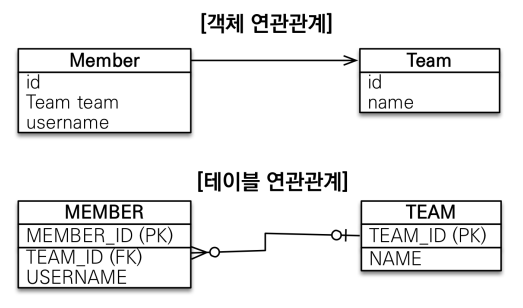
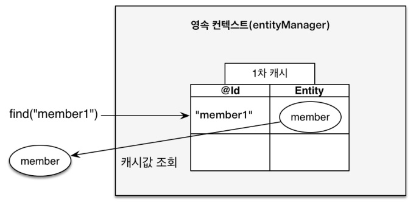
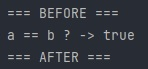
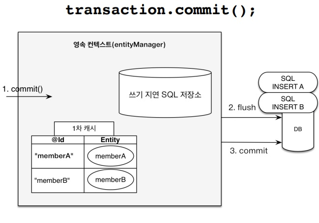
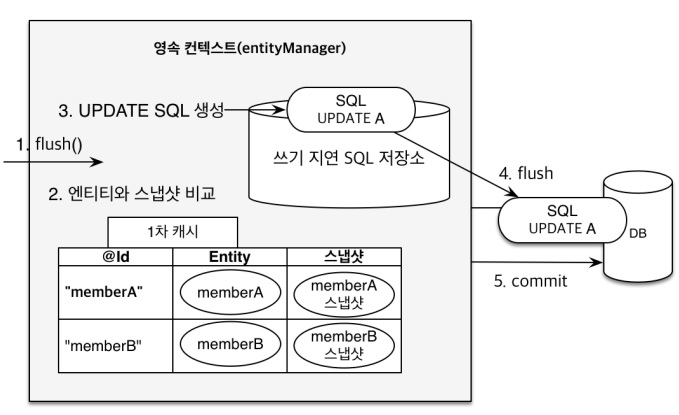

## JPA ?
### JPA의 등장 배경
#### → Java와  DB(RDBMS) 의 정보 저장 방식의 차이
(1) Java - Java에서 객체는 참조를 사용해 연관 데이터 조회
(2) RDBMS - 테이블에 외래 키를 사용.




* 즉, 기존의 JDBC Template, Mybatis 등의 기술이 있었음에도 객체 지향적인 프로그래밍이 아닌 SQL 중심적인 개발이 많은 시간과 노력을 들이게 됐다.
* 앞서 나온 기술들의 SQL 중심적인 개발 요소를 줄이고자 Java Persistence API(이하 JPA) 가 등장하게 됐다.


---

## JPA의 특징

### 1. 영속성 컨텍스트

* 엔티티를 영구 저장하는 환경 (컨테이너)

1) 1차 캐시
1) 동일성 보장
1) 트랜잭션을 지원하는 쓰기 지연
1) 변경 감지
1) 지연 로딩

---

#### 1) 1차 캐시

* em.persist() 로 객체가 1차 캐시에 저장되지만, DB에 저장된 것은 아니다.

  → 이후 트랜잭션을 커밋해야 실제로 DB에 객체 관련 쿼리가 입력되고, 그 때 저장된다.

* 즉, 저장되기 전까진 객체의 상태와 관련된 변경사항이 있을 경우, 변경사항에 따른 쿼리를 JPA에서 자동적으로 설정해 준다. (CRUD 관련)

```java
Member member = new Member();
member.setId("member1");
member.setUsername("회원1");

// 1차 캐시에 저장
em.persist(member);

// 1차 캐시에서 조회
Member findMember = em.find(Memeber.class, "member1");
```



---

#### 2) 동일성 보장

* 1차 캐시에 저장된 객체는 반복 가능한 읽기 상태를 애플리케이션 차원에서 제공한다.

  → 1차 캐시에 저장된 객체에 한해, DB로 조회쿼리가 반복적으로 날아가지 않는다.

```java
System.out.println("=== BEFORE ===");
Member a = em.find(Member.class,"member1");
Member b = em.find(Member.class,"member1");
System.out.println("a == b ? -> "+ (a == b));
System.out.println("=== AFTER ===");
```



---

#### 3) 트랜잭션을 지원하는 쓰기 지연

(1) 트랜잭션을 커밋할 때까지 INSERT SQL을 모았다가 트랜잭션 Commit 시, 쌓인 Insert 쿼리를 모아서 보냄. 

```java
EntityManager em = emf.createEntityManager();
EntityTransaction transaction = em.getTransaction();
transaction.begin(); // 트랜잭션 시작

em.persist(memberA);
em.persist(memberB);
// ↑ 위까지는 쿼리문이 작성되지 않는다. (1차캐시 영역)

// ↓ commit 순간 DB에 쿼리문이 작성된다.
transaction.commit(); // 트랜잭션 커밋
```



---

#### 4) 변경 감지

```java
EntityManager em = emf.createEntityManager();
EntityTransaction transaction = em.getTransaction();
transaction.begin(); // 트랜잭션 시작

// 엔티티 조회
Member memberA = em.find(Member.class, "memberA");

// 엔티티 데이터 수정
memberA.setUsername("JPA");
memberA.setAge(32);

transaction.commit(); // 트랜잭션 커밋
```

* 위 예시 코드처럼 데이터 수정이 있을 시, 기존 JDBC에서는 Java 코드에서도 update() 관련 코드를 작동해야 했다.

  ​	→ JPA에선 엔티티의 1차 캐시에 조회됐을 당시와 비교해 변경이 감지될 시, 자동으로 관련 Update 문을 작성해 DB에 보낸다.

* 예외적으로 설정하는 경우가 아니라면, 변경 관련 쿼리 역시 위의 트랜잭션을 지원하는 쓰기 지연과 동일한 타이밍에 작동한다. (commit 시).



---
### 2. 영속성 컨텍스트의 플러시

* 영속석 컨텍스트의 변경내용을 DB에 반영하는 것을 의미.

#### 1) 플러시 발생 경우

1. 변경 감지 (Dirty Checking) 로 저장소의 쿼리를 DB에 전송한 경우.

#### 2)  영속성 컨텍스트를 플러시하는 방법.

1. em.flush() - 직접 호출.
2. 트랜잭션 커밋 - 플러시 자동 호출.
3. JPQL 쿼리 실행 - 플러시 자동 호출.

---


```toc

```