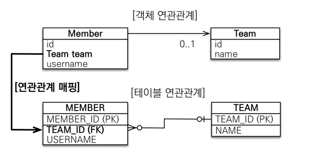

## 다양한 연관관계 매핑 기초

> 들어가기 전에
>
>  프로그래머스에서 JPA가 아닌 JDBC Template를 이용한 [과제관](https://programmers.co.kr/skill_check_assignments/232)이 있다. 과제관을 다 풀진 못 했었지만, JPA를 사용하는 근본 목적과 동일한 생각을 경험했다.  → JDBC Template을 사용하면 객체 중심적인 프로그래밍이 아닌 SQL 매퍼로서의 프로그래밍을 하겠끔 된다?
>
>  위의 경험으로 이 상황을 연관 관계로 풀어낼 수 있는 지가 JPA를 사용하는 숙련도 판단 근거일 것이라 생각한다. (물론 그 배경으로 관계형 DB 모델에 관한 숙련도가 있겟지만..)
>
>  그래서 이번 강의 시간과 차후 강의인 고급 매핑, 상속관계를 나만의 방식으로 체득해야겠다고 다짐했다.

---

### 1. 객체와 테이블 연관관계의 차이

* 다음과 같은 Member, Team 객체가 있고, DB(테이블)에 맞춘 모델링을 한 것이라 가정하자.


```java
// Member.java
@Entity
public class Member {

    @Id @GeneratedValue
    @Column(name = "MEMBER_ID")
    private Long id;

    @Column(name = "USERNAME")
    private String username;

    @Column(name = "TEAM_ID")
    private Long teamId;
    .. // Getter, Setter, ToString()
}
```

```java
// Team.java
@Entity
public class Team {

    @Id
    @GeneratedValue
    @Column(name = "TEAM_ID")
    private Long id;

    private String name;
    .. // Getter, Setter, ToString()
}
```

---

#### * 의문점

* Member를 통해 Team 객체의 정보를 얻어오려면 어떤 방식을 거치게 될까?

```java
public class JpaMain {
    public static void main(String[] args) {
    // Main.java 일부
    // Team과 Member 객체를 저장시키기 위한 과정 Start
    Team team = new Team();
    team.setName("TeamA");
    em.persist(team);

    Member member = new Member();
    member.setUsername("member1");
    member.setTeamId(team.getId());
    em.persist(member);
    // Team과 Member 객체를 저장시키기 위한 과정 End

    // 이 과정을 거치게 될 것이다.
    Member findMember = em.find(Member.class, member.getId());
    Long findTeamId = findMember.getTeamId();
    Team findTeam = em.find(Team.class, findTeamId);
    System.out.println(findTeam.toString());
    //... EntityManager, try{} catch{} 등의 과정 생략.
    }
}
```

 연관 관계를 생성하지 않고, 객체 모델링이 테이블에 맞춘 형식이라면 위와 같이 Member를 통해 Team의 Id를 얻고 그 Id로 Team 객체를 얻게 될 것이다. 이는 Java스럽지 않다고 할 수 있다. (이런 현상을 협력 관계를 만들지 못한다고 할 수도 있다.)

 협력 관계가 없는 문제점을 해결하고자 사용하는 연관 관계 매핑이며, 상세 과정은 아래에서 설명한다.

---

### 2. 단방향 연관 관계



* 1.에서의 Member 객체를 다음과 같이 수정한다.

```java
// Member.java
@Entity
public class Member {

    @Id @GeneratedValue
    @Column(name = "MEMBER_ID")
    private Long id;

    @Column(name = "USERNAME")
    private String username;

    //@Column(name = "TEAM_ID")
    //private Long teamId;
    @ManyToOne
    @JoinColumn(name = "TEAM_ID")
    private Team team;
    
    .. // Getter, Setter, ToString()
}
```


 위와 같이 Member 객체를 수정한 것 만으로, 1. JpaMain.java에서 Team 객체 정보를 얻고자 했던 많은 과정이 단축된다.

```java
public class JpaMain {
    public static void main(String[] args) {
    // Main.java 일부
    // Team과 Member 객체를 저장시키기 위한 과정 Start
    Team team = new Team();
    team.setName("TeamA");
    em.persist(team);

    Member member = new Member();
    member.setUsername("member1");
    //member.setTeamId(team.getId()); 
    member.setTeam(team);
    em.persist(member);
    // Team과 Member 객체를 저장시키기 위한 과정 End

    /* DB에서 조회하는 쿼리를 보고 싶다면 해당 주석을 제거하면 된다.
    em.flush();
    em.clear();
    */
        
    // 이 과정을 거치게 될 것이다.
    Member findMember = em.find(Member.class, member.getId());
    Team findTeam = findMember.getTeam();
    System.out.println(findTeam.toString());
    //... EntityManager, try{} catch{} 등의 과정 생략.
    }
}
```


---
### 3. 양방향 연관 관계

#### * 의문점

* 2.에서의 단방향 연관 관계에서 Team 객체를 통해 Team에 속한 Member를 얻는 것이 가능할까?

​		→ 결론부터 말하면 안 된다. 왜? Team에서 Member의 연관 관계 설정이 없기 때문이다. 즉, 양방향 연관 관계를 맺지 않았기 때문이다.

---

> 단방향 연관 관계의 Member와 Team 객체를 수정해 사용한다.

* Team 객체에서 Team에 속한 Member를 얻기 위해서, 기존의 Team 객체에 Member와 관련된 연관 관계를 추가한다. 

  ​	@OneToMany를 사용하며, mappedBy 속성으로 어떤 객체가 연관 관계의 주인인지 표현한다.

```java
// Team.java | Member.java는 단방향 예시와 동일.
@Entity
public class Team {

    @Id
    @GeneratedValue
    @Column(name = "TEAM_ID")
    private Long id;

    private String name;
    
    // 추가 코드
    @OneToMany(mappedBy = "team")
    List<Member> members = new ArrayList<Member>();
    .. // Getter, Setter, ToString()
}
```

```java
// Member.java 1.의 단방향 연관 관계의 Member와 동일하다.
@Entity
public class Member {

    @Id @GeneratedValue
    @Column(name = "MEMBER_ID")
    private Long id;

    @Column(name = "USERNAME")
    private String username;

    //@Column(name = "TEAM_ID")
    //private Long teamId;
    @ManyToOne
    @JoinColumn(name = "TEAM_ID")
    private Team team;
    
    .. // Getter, Setter, ToString()
}
```

---

#### * 양방향 연관 관계의 주인?

* 연관 관계의 주인은 DB 테이블 상의 외래 키가 있는 객체다. 즉, 1:N 관계에서 N이 연관 관계의 주인이 된다.

  위의 Member와 Team의 사례로 보자면, Member가 N이고, Team이 1이므로 Member 객체가 연관 관계의 주인이 된다.

  정확하게 얘기하면, Member.team이 주인이 된다.


---

#### * 양방향 연관 관계 매핑 규칙

1. 연관 관계의 주인만이 외래 키를 관리(등록, 수정)
2. 주인이 아닌 쪽은 읽기만 가능
3. 주인은 mappedBy 속성 사용하지 않는다.
4. 주인이 아닌 쪽(1:N에서 1의 역할)은 mappedBy 속성으로 주인을 지정한다.

---

#### ! 양방향 연관 관계 매핑 시 주의할 점 !

1. 연관 관계의 주인에 값을 입력 안 하는 경우.

   ​	위의 Member.team 에 값을 넣지 않는 경우 + team.getMembers().add(Member) 에 값이 입력되지 않는 경우 둘 다 포함.

2. 양방향 매핑 시 발생할 수 있는 무한 루프 조심 (ex: toString(), lombok, JSON 생성 라이브러리)

##### * 각 상황 예시와 방지책

###### (1) 연관 관계 주인에 값 미입력.

```java
// JpaMain.java
Team team = new Team();
team.setName("TeamA");
em.persist(team);

Member member = new Member();
member.setUsername("member1");
em.persist(member);

// 역방향 연관 관계
team.getMembers().add(member);
```

* 위 코드를 실행 시, DB에 실제 저장되는 값은 다음과 같다.


* Member의 Team_id가 null로 들어가는 것을 확인할 수 있는데, 연관 관계의 주인인 Member의 Team, 즉, Member.setTeam() 으로 값을 입력해야 저장된다.

  위의 사례로 추가적으로 알 수 있는 중요 사항이 있는데, 바로 **역방향 연관 관계(주인이 아닌 쪽, Team)는 읽기만 가능하다**는 것이다.

  아래와 같이 수정해야 MEMBER의 TEAM_ID가 null로 입력되지 않는다.

```java
// JpaMain.java
Team team = new Team();
team.setName("TeamA");
em.persist(team);

Member member = new Member();
member.setUsername("member1");
member.setTeam(team); // 주인인 Member.team 값을 설정한다.
em.persist(member);

// 역방향 연관 관계
team.getMembers().add(member);
```


:ear: 추가 Tip! - 연관 관계 편의 메소드 설정.

 모든 양방향 연관 관계에 대해 신경을 못 쓸 수도 있다. 그래서 연관 관계 객체의 Setter를 수정해 편의 메소드를 설정하는 방법이 있다.

```java
// Member.java 1.의 단방향 연관 관계의 Member와 동일하다.
@Entity
public class Member {
    // 각 컬럼 매핑 설정...
    public void setTeam(Team team) {
        this.team = team;
        // 위의 JpaMain.java에서의 역방향 연관 관계
        team.getMembers().add(this); 
    }
}
```

JpaMain.java의 역방향 연관 관계를 Setter에 추가함으로, Member.setTeam()을 하는 것으로 같은 효과를 얻을 수 있다.

> 위에선 연관 관계의 주인인 Member에서 역방향 연관 관계를 설정했지만, 반대로 Team 객체에서 설정할 수도 있다. 상황 따라 정하기 나름인 것으로 알고 그때그때 맞춰 적용하면 된다.

---

###### (2) 무한 루프 - ex: toString()

* toString()을 연관 관계 양쪽에 설정한 경우, 서로 연관된 객체의 toString()을 호출한다. stack overflow 에러가 발생하는 상황이 온다.

​	! 해결책 !

​	1) Controller 단에선 Entity를 반환하지 않도록 설계한다.

---


```toc

```