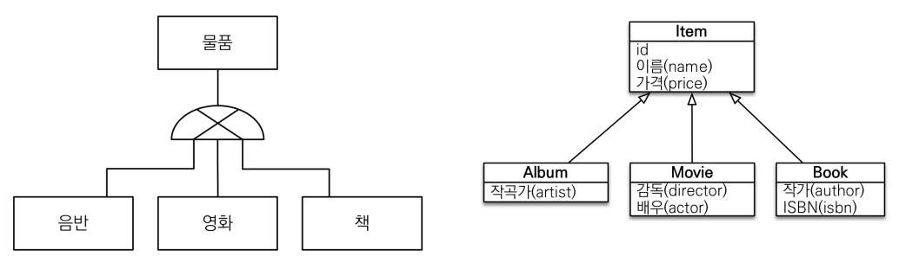
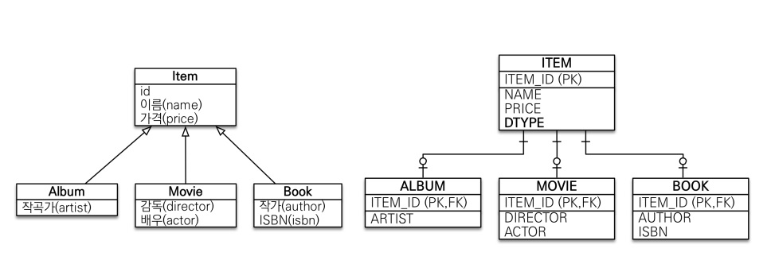
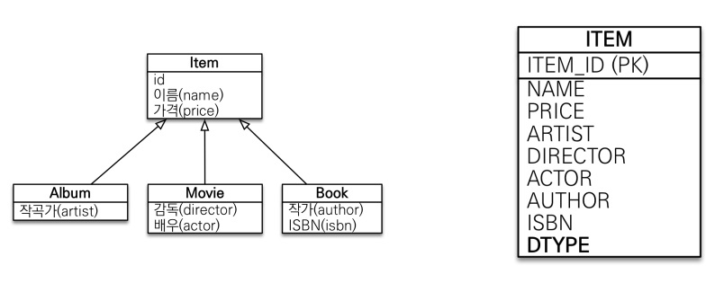
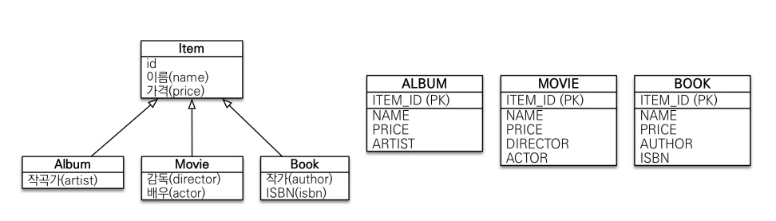
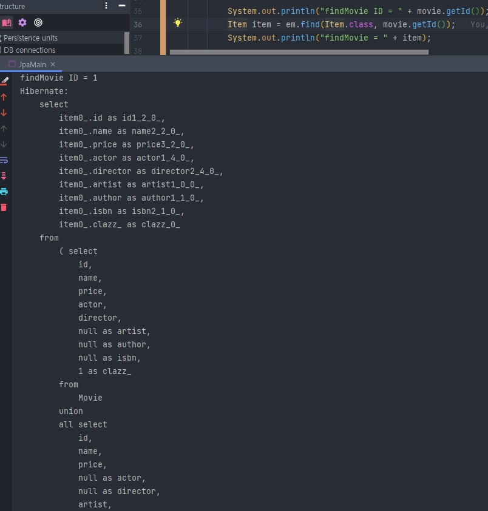

## 상속 관계 매핑

### 1. 관계형 DB에서의 상속 관계?

 결론부터 얘기하면, 관계형 DB에서 상속 관계는 존재하지 않는다. 다만, 슈퍼 타입 / 서브 타입 관계라는 모델링 기법이 객체 상속과 유사하다.



* 그래서 JPA에서의 상속 관계 매핑은 DB에서의 슈퍼 타입, 서브 타입 관계를 매핑하는 것으로 약칭하며 구체적인 방법은 조인 전략, 단일 테이블 전략, 구현 클래스마다 테이블 전략 3가지가 있다.

---

### 2. 주요 Annotation

| Annotation                                   | 설명                                                         |
| -------------------------------------------- | ------------------------------------------------------------ |
| @Inheritance(strategy = InheritanceType.XXX) | 사용할 전략 방법을 명시하며, 3가지가 존재한다.<br />1) JOINED: 조인 전략<br />2) SINGLE_TABLE: 단일 테이블 전략<br />3) TABLE_PER_CLASS: 구현 클래스마다 테이블 전략 |
| @DiscriminatorColumn(name = "DTYPE")         | DTYPE, 즉, 상속 받은 객체의 타입이 무엇인지 부모 테이블에서 설명하는 컬럼 (Default - DTYPE) |
| @DiscriminatorValue("XXX")                   | 자식 객체 (사진의 Album, Movie, Book)가 테이블에 저장될 DTYPE 이름 지정 시 사용. |

---

### 3. @Inheritance 의 각 속성 설명

#### 1) JOIN 전략



1. 장점
   * 테이블 정규화
   * 외래 키 참조 무결성 제약 조건 활용 가능
   * 저장 공간 효율화

2. 단점
   * 조회 시 조인을 많이 사용, 성능 저하
   * 조회 쿼리가 복잡함.
   * 데이터 저장 시 INSERT SQL 2번 호출

---

#### 2) SINGLE_TABLE 전략

* 한 테이블에 자식 객체가 모두 들어가므로 구분 값인 DTYPE이 기본 값으로 들어가게 되어있다.



1. 장점
   * 조인이 필요 없으므로 일반적으로 조회 성능이 빠르고 단순.

2. 단점
   * 자식 엔티티가 매핑한 컬럼은 모두 Null 허용.
   * 단일 테이블에 모든 것을 저장하므로 테이블이 커질 수 있고, 상황에 따라 조회 성능이 느려질 수 있다.

---

#### 3) TABLE_PER_CLASS 전략 - 사용하지 않는다고 생각!



1. 장점
   * 서브 타입을 명확하게 구분해서 처리할 때 효과적.
   * Not Null 제약 조건 사용 가능
   
2. 단점
   * 여러 자식 테이블을 함께 조회할 때 성능이 느림 (UNION SQL 필요)
   * 자식 테이블을 통합해서 쿼리하기 어려움.
   
   * 아래 이미지와 같이 부모 속성으로 조회할 경우, 성능 이슈가 발생하게 될 것이다. (즉, 실무적으로 사용하기 어려울 것이다.)



---

### 4. @MappedSuperclass

* 상속 관계 매핑 X 
* 엔티티 X, 테이블과 매핑 X
* 공통 매핑 정보가 필요할 때 사용한다.
* 조회, 검색 불가 및 추상 클래스 권장

 게시판의 경우로 예를 들면


```toc

```