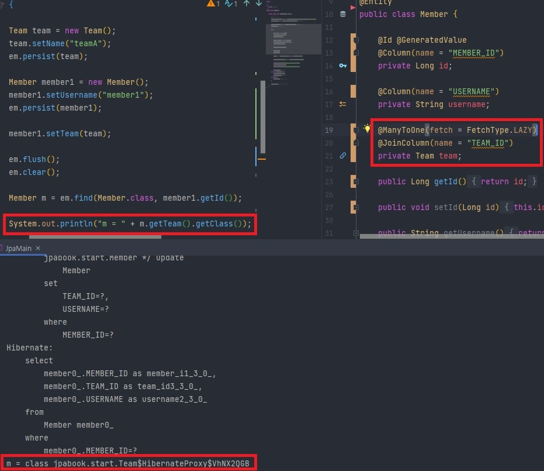

## 프록시

> 프록시 단독으로 쓰이는 경우는 실무적으론 많이 없다고 한다. 그러면 "왜 배워야 할까?" 라는 의문이 들텐데, 바로 뒤에서 배울 지연 로딩 개념을 이해하기 위해서 라고 정리할 수 있다.

### 1. 프록시 기초

* em.find( ) VS **em.getReference**( )
  1.  em.find() : DB를 통해 실제 엔티티 객체 조회.
  2.  em.getReference() : DB 조회를 미루는 가짜(프록시) 엔티티 객체 조회

---

### 2. 프록시 특징

* 프록시 객체는 실제 객체의 참조(target)를 보관.
* 처음 사용할 때 한 번만 초기화.
* 프록시 객체가 초기화 되면 프록시 객체를 통해 실제 엔티티에 접근 가능.
* <u>**영속성 컨텍스트에 찾는 엔티티가 이미 존재**</u>하는 경우, em.getReference() 를 호출해도 <u>**실제 엔티티를 반환**</u>한다.


  반대로, 영속성 컨텍스트에 찾는 엔티티가 없는 경우엔 HibernateProxy 클래스 객체를 갖게 된다. 이 때 em.getReference()로 먼저 호출 후, em.find()로 실제 엔티티 객체를 찾는 경우엔 em.find() 로 찾는 객체도 실제 엔티티가 아닌 HibernateProxy 클래스 객체를 갖는 다는 점이다.


* 프록시 객체는 원본 엔티티를 상속 받기에, **<u>타입 체크</u>** 시 주의해야한다. ( == 비교는 실패 / <u>**instance of 를 사용**</u>해야함. )


* 준영속 상태일 때, 프록시를 초기화 하면 문제 발생한다. (org.hibernate.LazyInitializationException 예외 발생)
* 프록시 인스턴스의 초기화 여부 확인 - PersistenceUnitUtil.isLoaded(Object entity)


* 강제 초기화 - Hibernate.initialize(entity); JPA 표준엔 없기에, 위의 이미지처럼 강제 호출로 초기화하여야 한다.

---

## 지연 로딩과 즉시 로딩

* 연관 관계에서 fetch 타입 지정에 따라 지연 로딩(fetchType.LAZY)과 즉시 로딩(fetchType.EAGER)으로 갈리게 된다.
* 지연 로딩은 위에서 설명한 프록시로 연관 관계를 조회해 오는 것을 의미하며, 즉시 로딩은 실제 엔티티로 즉시 조회해 오는 것을 의미한다.

---

### 1. 지연 로딩 예시 코드



* Member와 Team은 연관 관계를 가지고 있는데, 타입을 LAZY로 걸었고 비즈니스 로직 상으로 Member 객체의 Team 엔티티를 프록시로 조회해 온 결과다.
* 실제 team을 사용하는 시점에 초기화 된다. (하단 이미지 참고)


---

### 2. 즉시 로딩 예시 코드


* 지연 로딩과 다르게 초기화 시점이 아닌, 연관 데이터(위의 코드에서 Team 엔티티)를 조회할 때 프록시 객체가 아닌 실제 엔티티를 가져온 것이다. 따라서 초기화 여부와 관계없이 이미 Team 클래스를 가진 것으로 출력되는 모습을 확인할 수 있다.

---

### 3. 실무 활용 Tip

1. 모든 연관 관계에 **<u>지연 로딩 사용</u>**!

2. 즉시 로딩 사용 금지!

   * Why? 후에 3.에서 얘기한 JPAL을 많이 쓰게 되는데, JPQL을 쓸 때 N+1 개의 쿼리가 발생하게 된다.

     

      위 예시에선 각각 1개의 Member, Team 객체를 등록 후, 조회 쿼리를 날렸는데 1번의 쿼리로 끝날 수 있는 쿼리가 N+1, 즉, 총 2회 쿼리가 발생한 것이다. 예시로 쓴 데이터는 1개 뿐이라 2회로 끝이었지만, 만약 실제 운영 데이터였다면 단위가 십만으로 넘어갈 수도 있을 것이다. 따라서 EAGER은 무조건 X라 생각하자.

     [^N+1]: 조회된 데이터 갯수(N)만큼 연관 관계의 조회 쿼리가 추가로 발생하는 것을 의미.

3. JPQL fetch 조인 /  엔티티 그래프 기능을 사용.

   위에서 얘기한 것처럼 LAZY로 사용한다고 해도 결국 초기화를 하면 조회를 추가로 해야하는 N+1 문제가 발생한다. 이를 해결하기 위해 JPQL에서 fetch join이라는 문법이나 @EntityGraph를 사용하는 대안이 있다. (추후 학습함.)

4. 표처럼 각 Annotation마다 기본 값이 다르므로 꼭 지정하는 것을 습관 들이도록 하자.

| Annotation              | 기본 값 |
| ----------------------- | ------- |
| @OneToMany, @ManyToMany | LAZY    |
| @ManyToOne, @OneToOne   | EAGER   |

---


```toc

```