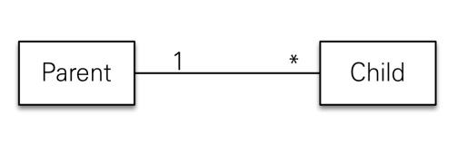
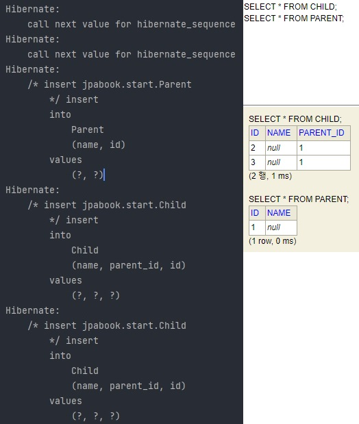

## 영속성 전이

* 특정 엔티티를 영속 상태로 만들 때, 연관된 엔티티도 함께 영속 상태로 만들고 싶을 때 사용.
  ex: 부모 엔티티를 저장할 때, 자식 엔티티도 함께 저장.




---

### * 영속성 전이 예시

* 위 이미지 Parent와 Child 샘플 엔티티 코드다. Parent.java에서 childList라는 연관 관계에서 cascade 속성을 준 것을 확인할 수 있다.

#### 1) 객체 코드 예시

```java
// Parent.java
@Entity
public class Parent {
    @Id
    @GeneratedValue
    private Long id;

    private String name;

    @OneToMany(mappedBy = "parent", cascade = CascadeType.ALL)
    private List<Child> childList = new ArrayList<>();

    public void addChild(Child child) {
        childList.add(child);
        child.setParent(this);
    }

    public Long getId() {
        return id;
    }

    public void setId(Long id) {
        this.id = id;
    }

    public String getName() {
        return name;
    }

    public void setName(String name) {
        this.name = name;
    }
}
```

```java
// child.java
@Entity
public class Child {
    @Id
    @GeneratedValue
    private Long id;

    private String name;

    @ManyToOne
    @JoinColumn(name = "parent_id")
    private Parent parent;

    public Parent getParent() {
        return parent;
    }

    public void setParent(Parent parent) {
        this.parent = parent;
    }

    public Long getId() {
        return id;
    }

    public void setId(Long id) {
        this.id = id;
    }

    public String getName() {
        return name;
    }

    public void setName(String name) {
        this.name = name;
    }
}
```

---

#### 2) Main.java 예시

```java
public class JpaMain {

    public static void main(String[] args) {

        //엔티티 매니저 팩토리 생성
        EntityManagerFactory emf = Persistence.createEntityManagerFactory("jpabook");
        EntityManager em = emf.createEntityManager(); //엔티티 매니저 생성

        EntityTransaction tx = em.getTransaction(); //트랜잭션 기능 획득
        tx.begin(); //트랜잭션 시작

        try {

            Child child1 = new Child();
            Child child2 = new Child();

            Parent parent = new Parent();

            parent.addChild(child1);
            parent.addChild(child2);

            em.persist(parent);
//			child1, child2 객체를 직접 Entity Manager에 등록하지 않음.
//            em.persist(child1);
//            em.persist(child2);

            tx.commit();//트랜잭션 커밋
        } catch (Exception e) {
            e.printStackTrace();
            tx.rollback(); //트랜잭션 롤백
        } finally {
            em.close(); //엔티티 매니저 종료
        }

        emf.close(); //엔티티 매니저 팩토리 종료
    }
}
```

* 위의 Main 코드에서 생성한 Parent, Child1, Child2를 모두 DB에 저장하기 위해서는 Cascade 속성이 없다면 총 3개의 Entity Manager 객체에 영속시켜야 한다.
  ex: em.persist(parent); em.persist(child1); em.persist(child2);
* 하지만 1) 객체 코드 예시에서 Parent에서 지정한 것과 같이 Cascade 속성을 준 것으로 Parent 객체만 엔티티 매니저에 등록 후 실행시키면 모두 DB에 저장되는 것을 확인할 수 있다.



---

#### ** 주의점

* 영속성 전이는 연관 관계를 매핑하는 것과는 관련이 없다.
* 엔티티를 영속화할 때, 연관된 엔티티도 함께 영속화하는 편리함 만을 제공하는 것이다!
* **전이할 엔티티의 생명 주기가 동일하거나 유사한 경우와 단일 소유자인 경우에만 쓰고 아니면 전이되지 않게 설계하는 것이 최상**이다.

---

```toc

```