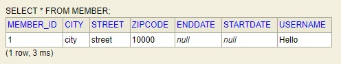
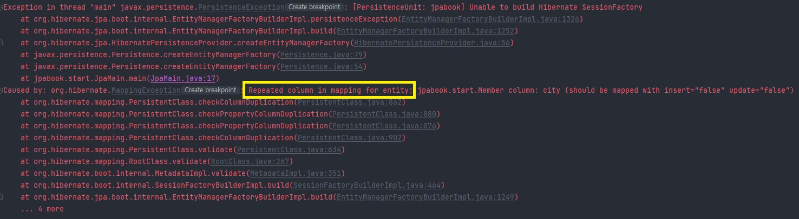
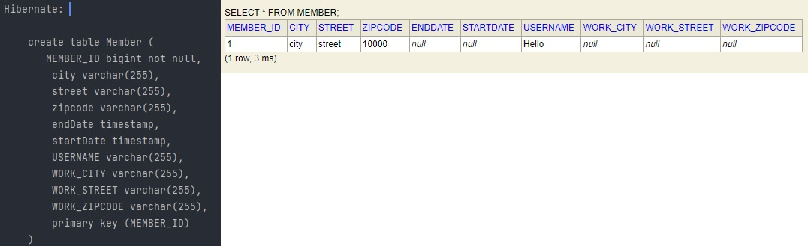
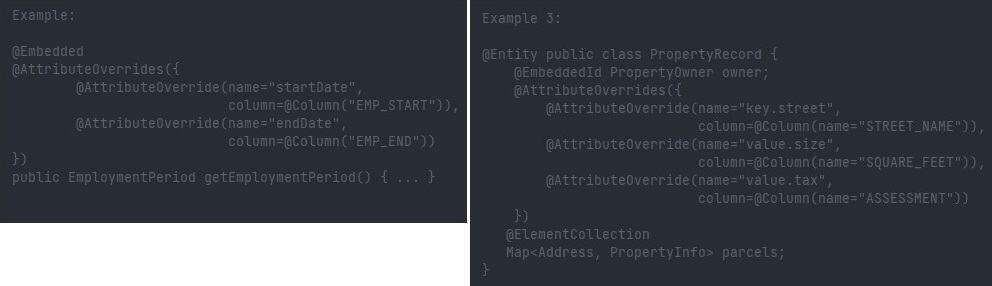
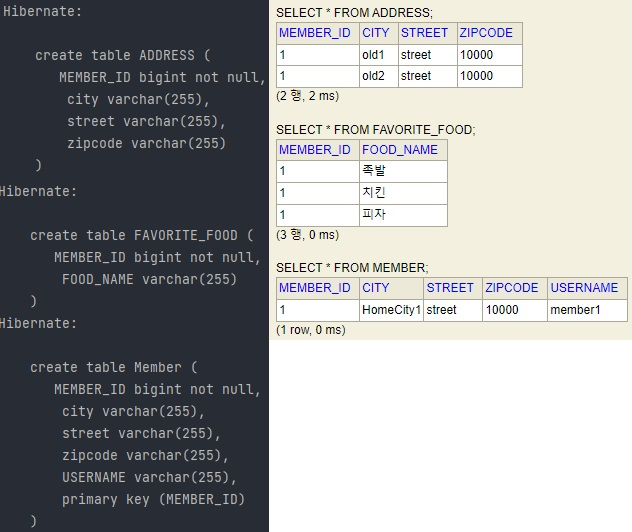
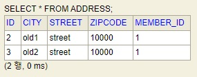

## 값 타입

1. JPA 최상위 값 타입 분류
2. 기본 값 타입
3. 임베디드 타입 (복합 값 타입) **
4. 값 타입과 불변 객체
5. 값 타입의 비교
6. 값 타입 컬렉션 **

---

### 1. JPA 최상위 값 타입 분류

#### 1) 엔티티 타입

* @Entity로 정의하는 객체
* 데이터가 변해도 식별자로 지속해서 추적 가능

#### 2) 값 타입

* int, Integer, String처럼 단순히 값으로 사용하는 자바 기본 타입이나 객체
* 식별자가 없고 값만 있으므로 변경 시 추적 불가

---

### 2. 기본 값 타입

* 생명 주기를 엔티티에 의존
* 값 타입은 절대 공유하지 말 것!

---

### 3. 임베디드 타입 **

* 복합 값 타입이며, 객체를 코드로 명확하게 표현하기 위한 수단이라는 느낌으로 받아들이는 것이 편하다.

#### * 임베디드 타입 사용법

| Annotation          | 설명                             |
| ------------------- | -------------------------------- |
| @Embeddable         | 값 타입을 **정의하는 곳**에 표시 |
| @Embedded           | 값 타입을 **사용하는 곳**에 표시 |
| @AttributeOverrides | 컬럼명 중복 시 사용.             |
| @AttributeOverride  | 컬럼명 중복 시 사용.             |


#### * 임베디드 타입 구현 예시

* Member 엔티티가 이름, 근무 시작일, 근무 종료일, 주소 도시, 주소 번지, 주소 우편번호를 가진다고 하자. 아래와 같이 표현할 것이다.

```java
// Member.java - Embedded Before
@Entity
public class Member {

    @Id @GeneratedValue
    @Column(name = "MEMBER_ID")
    private Long id;

    @Column(name = "USERNAME")
    private String username;
    
    // 기간
    private LocalDateTime startDate;
    private LocalDateTime endDate;
    // 주소
	private String city;
    private String street;
    private String zipcode;
    
    // Getter, Setter ....
}
```

 위의 기간과 주소를 그대로 사용해도 무방하지만, 명확하게 기간과 주소라는 객체로 묶어서 쓸 수도 있다.

---

#### 1) 주소와 기간 객체 구현 (@Embeddable 사용)

```java
// Address.java
@Embeddable
public class Address {
    private String city;
    private String street;
    private String zipcode;

    public Address() {
    }

    public Address(String city, String street, String zipcode) {
        this.city = city;
        this.street = street;
        this.zipcode = zipcode;
    }
    // Getter, Setter..
}
```

```java
// Period.java
@Embeddable
public class Period {
    private LocalDateTime startDate;
    private LocalDateTime endDate;

    public Period() {
    }

    public Period(LocalDateTime startDate, LocalDateTime endDate) {
        this.startDate = startDate;
        this.endDate = endDate;
    }
	// Getter, Setter..
}
```

---

#### 2) Member.java에 주소, 기간 객체 사용 (@Embedded)

```java
// Member.java
@Entity
public class Member {

    @Id @GeneratedValue
    @Column(name = "MEMBER_ID")
    private Long id;

    @Column(name = "USERNAME")
    private String username;

    //기간 Period
    @Embedded
    private Period period;

    //주소
    @Embedded
    private Address address;
```

---

#### 3) Main.java 예시

```java
// Main.java
Member member = new Member();
member.setUsername("Hello");
member.setHomeAddress(new Address("city","street","10000"));
member.setWorkPeriod(new Period());

em.persist(member);
```



* 기존의 테이블 변경 없이, 데이터가 잘 들어가는 모습을 확인할 수 있다.

---

#### 4) @AttributeOverrides, @AttributeOverride 속성 재정의 사용 예시

* Member에 있는 주소가 집 주소, 근무지 주소가 있다고 가정하자.

```java
// Member.java - Not Use @AttributeOverrides, @AttributeOverride
@Entity
public class Member {

    @Id @GeneratedValue
    @Column(name = "MEMBER_ID")
    private Long id;

    @Column(name = "USERNAME")
    private String username;

    //기간 Period
    @Embedded
    private Period period;

    // 집 주소
    @Embedded
    private Address homeAddress;
	// 근무지 주소
    @Embedded
    private Address workAddress;
```

* 아래와 같이 중복된 컬럼 명이라는 에러가 발생하는 것을 확인할 수 있다.



* 같은 임베디드 타입을 사용하지만, 컬럼명을 다르게 표기하기 위해 @AttributeOverrides, @AttributeOverride 속성을 사용한다.

```java
// Member.java - Use @AttributeOverrides, @AttributeOverride
@Entity
public class Member {

    @Id @GeneratedValue
    @Column(name = "MEMBER_ID")
    private Long id;

    @Column(name = "USERNAME")
    private String username;

    //기간 Period
    @Embedded
    private Period period;

    //주소
    @Embedded
    private Address homeAddress;

    @Embedded
    @AttributeOverrides({
            @AttributeOverride(name="city",
                    column=@Column(name="WORK_CITY")),
            @AttributeOverride(name="street",
                    column=@Column(name="WORK_STREET")),
            @AttributeOverride(name="zipcode",
                    column=@Column(name="WORK_ZIPCODE"))
    })
    private Address workAddress;
```



* 테이블에 기존의 집 주소와, @AttributeOverrides 속성으로 컬럼명을 지정한 근무지 주소 값으로 정상적으로 테이블이 생성된 모습을 확인할 수 있다.

---

#### * 참고사항

* 클래스 설명에 샘플 예시가 상세하게 나와 있으므로 실사용법은 참고하면 된다.



---

### 4. 값 타입과 불변 객체

* 객체 타입은 생성자로만 값을 설정하고 수정자(Setter)를 만들지 않는 방식으로 설계해야 한다.

  ex) Setter는 모두 private 형식으로 만들어 Setter를 호출할 수 없게 만든다.

```java
@Embeddable
public class Address {
    private String city;
    private String street;
    private String zipcode;

    public Address() {
    }

    public Address(String city, String street, String zipcode) {
        this.city = city;
        this.street = street;
        this.zipcode = zipcode;
    }

    public String getCity() { return city; }
    
    public String getStreet() { return street; }
    
    public String getZipcode() { return zipcode; }

    private void setCity(String city) { this.city = city; }

    private void setStreet(String street) { this.street = street; }

    private void setZipcode(String zipcode) { this.zipcode = zipcode; }
}

```

* 이렇게 된 경우, Member 객체의 Address를 수정하기 위해선 Address 인스턴스를 새로 생성하는 방법 밖에 없다.


* 예를 들어, 어떤 Member가 이사를 가 Address 중 city 값만 수정하는 상황이라고 가정하자.

```java
// Main.java
Member member = new Member();
member.setUsername("member1");
member.setHomeAddress(new Address("HomeCity1","street","10000"));

member.getFavoriteFoods().add("치킨");
member.getFavoriteFoods().add("족발");
member.getFavoriteFoods().add("피자");

member.getAddresseHistory().add(new Address("old1","street","10000"));
member.getAddresseHistory().add(new Address("old2","street","10000"));

em.persist(member);

Member findMember = em.find(Member.class, member.getId());

Address a = findMember.getHomeAddress();
// 기존 Address 인스턴스 값 중, city 값만 new 생성자로 교체
findMember.setHomeAddress(new Address("newCity",a.getStreet(),a.getZipcode()));
```

위와 같이 새로운 Address 인스턴스를 생성하는 방식으로 진행해야 Side Effect가 나지 않을 방법으로 정보를 수정할 수 있다.

---

### 5. 값 타입의 비교

1. 참조 값 비교: == 사용

2. 인스턴스의 값 비교: equals() 사용

   → 값 비교 시, equals() 메소드를 적절하게 재정의 필요. (hashCode()도 상황에 맞게 재정의 필요)

```java
// Address.java 중 equals(), hashCode() 재정의 예시
@Override
public boolean equals(Object o) {
    if (this == o) return true;
    if (o == null || getClass() != o.getClass()) return false;
    Address address = (Address) o;
    return Objects.equals(city, address.city) && Objects.equals(street, address.street) && Objects.equals(zipcode, address.zipcode);
}

@Override
public int hashCode() {
    return Objects.hash(city, street, zipcode);
}
```

---

### 6. 값 타입 컬렉션 **

* @ElementCollection, @CollectionTable 어노테이션을 사용한다.
* 컬렉션을 저장하기 위한 별도의 테이블이 필요하다.

```java
// Member.java 컬렉션 추가 예시
@Entity
public class Member {

    @Id @GeneratedValue
    @Column(name = "MEMBER_ID")
    private Long id;

    @Column(name = "USERNAME")
    private String username;

    @Embedded
    private Address homeAddress;

    // 컬렉션 추가
    @ElementCollection
    @CollectionTable(name = "FAVORITE_FOOD", joinColumns =
        @JoinColumn(name = "MEMBER_ID")
    )
    @Column(name = "FOOD_NAME")
    private Set<String> favoriteFoods = new HashSet<>();

    // 컬렉션 추가
    @ElementCollection
    @CollectionTable(name = "ADDRESS", joinColumns =
        @JoinColumn(name = "MEMBER_ID")
    )
    private List<Address> addresseHistory = new ArrayList<>();
```

 위 Member 엔티티처럼 컬렉션 정보로 과거 주소 내역, 관심 음식 정보를 컬렉션 타입으로 저장하고자 한다.

```java
// Main.java
Member member = new Member();
member.setUsername("member1");
member.setHomeAddress(new Address("HomeCity1","street","10000"));
            
member.getFavoriteFoods().add("치킨");
member.getFavoriteFoods().add("족발");
member.getFavoriteFoods().add("피자");

member.getAddresseHistory().add(new Address("old1","street","10000"));
member.getAddresseHistory().add(new Address("old2","street","10000"));

em.persist(member);

Member findMember = em.find(Member.class, member.getId());

Address a = findMember.getHomeAddress();
findMember.setHomeAddress(new Address("newCity",a.getStreet(),a.getZipcode()));
```



* Member 객체의 임시 데이터를 넣고 실행 후 생성된 DB의 이미지로 컬렉션 타입 저장을 위한 별도의 테이블이 만들어지는 것을 확인할 수 있다.

#### !주의사항

- 값 타입 컬렉션에 변경 사항이 발생하면, 주인 엔티티와 연관된 모든 데이터를 삭제하고, 변경사항과 관련되지 않은 나머지 데이터를 다시 INSERT 작업을 거친다. 즉, 쿼리문이 N+1 상황과 유사하게 다시 나가는 상황이 발생하는 것뿐만 아니라, 추적하기에도 어려운 상황이 발생하므로 되도록 컬렉션 타입은 안 쓰는 것이 낫다.
- 값 타입 컬렉션 대신 일대다 관계를 고려하는 것이 나을 수도 있다.

```java
// Member.java 중 기존의 Address 컬렉션 타입 주석 후 수정

//    @ElementCollection
//    @CollectionTable(name = "ADDRESS", joinColumns =
//        @JoinColumn(name = "MEMBER_ID")
//    )
//    private List<Address> addresseHistory = new ArrayList<>();

@OneToMany(cascade = CascadeType.ALL, orphanRemoval = true)
@JoinColumn(name = "MEMBER_ID")
private List<AddressEntity> addressHistory = new ArrayList<>();
```

```java
// AddressEntity 신규 생성.
@Entity
@Table(name = "ADDRESS")
public class AddressEntity {
    @Id @GeneratedValue
    private Long id;

    private Address address;

    public AddressEntity() {
    }

    public AddressEntity(String city, String street, String zipcode) {
        this.address = new Address(city, street, zipcode);
    }
```

```java
member.getAddressHistory().add(new AddressEntity("old1","street","10000"));
member.getAddressHistory().add(new AddressEntity("old2","street","10000"));
```

* 위처럼 수정 후 실행하면, 아래와 같이 Address 테이블이 생성된다. Address 테이블에 기존에 없던 식별자(ID)가 생긴 것을 확인할 수 있다.



---

```toc

```