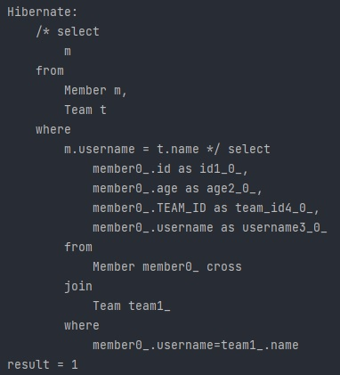

## JPQL

1. 프로젝션
2. 페이징
3. 조인
3. 서브 쿼리
3. JPQL 타입 표현
3. 조건식
3. 기본 함수와 사용자 정의 함수

---

### 1. 프로젝션

* SELECT 절에 조회할 **대상을 지정**하는 것.

#### 1) 대상

| 타입                                    | 예시                                   |
| --------------------------------------- | -------------------------------------- |
| 엔티티 프로젝션                         | SELECT m FROM Member m                 |
|                                         | SELECT m.team FROM Member m            |
| 임베디드 타입 프로젝션                  | SELECT m.address FROM Member m         |
| 스칼라 타입 프로젝션 (기본 데이터 타입) | SELECT m.username, m.age FROM Member m |

#### 2) 여러 타입 값 조회

1. Query 타입

```java
Query query = em.createQuery("SELECT m.username, m.age from Member m");
List resultList = query.getResultList();

Object o = resultList.get(0);
Object[] result = (Object[]) o;

System.out.println("result = " + result[0]);
System.out.println("result = " + result[1]);
```

* Query는 Object를 반환하기에 타입 캐스팅이 필요하다.

2. Object[] 타입

```java
List<Object[]> resultList = em.createQuery("SELECT m.username, m.age from Member m").getResultList();

Object[] result = resultList.get(0);

System.out.println("result = " + result[0]);
System.out.println("result = " + result[1]);
```

* 위의 Query 타입을 앞서 타입캐스팅하는 것과 동일한 이치로 보면 된다.

3. new 명령어 조회

```java
// MemberDTO.java
public class MemberDTO {
    private String username;
    private int age;

    public MemberDTO(String username, int age) {
        this.username = username;
        this.age = age;
    }

    public String getUsername() {
        return username;
    }

    public void setUsername(String username) {
        this.username = username;
    }

    public int getAge() {
        return age;
    }

    public void setAge(int age) {
        this.age = age;
    }
}
```

```java
List<MemberDTO> result = em.createQuery("SELECT new jpql.MemberDTO(m.username,m.age) from Member m", MemberDTO.class).getResultList();

MemberDTO memberDTO = result.get(0);

System.out.println("memberDTO.username = " + memberDTO.getUsername());
System.out.println("memberDTO.age = " + memberDTO.getAge());
```

* 위와 같이 DTO로 조회 결과를 SQL문에서 매핑하는 것이 가능하다.
* new 생성자로 매핑 시, 패키지 명을 모두 써야하는 것이 눈여겨 봐야하는 점이다. 이 과정은 꽤 불편하기에 단축하는 과정이 있다. ( 추후 학습 )

---

### 2. 페이징 API

* 2가지 API로 추상화.
  1. setFirstResult(int startPosition) : 조회 시작 위치
  2. setMaxResults(int maxResult) : 조회할 데이터 수

---

### 3. 조인

* 동작 방식은 DB와 동일하다.

| DB         | JPA                      |
| ---------- | ------------------------ |
| Inner Join | 내부 조인                |
| Outer Join | 외부 조인                |
|            | 세타 조인 (속칭: 막조인) |

* 세타 조인 예시

```java
Team team = new Team();
team.setName("teamA");
em.persist(team);

Member member = new Member();
member.setUsername("teamA");
member.setAge(10);
member.setTeam(team);

em.persist(member);

em.flush();
em.clear();

String query = "select m from Member m, Team t where m.username = t.name";
List<Member> result = em.createQuery(query, Member.class)
                            .getResultList();
System.out.println("result = " + result.size());
```

* 위에서 유심히 봐야할 것은 쿼리문이다.

* 실행결과



#### * JPA 조인 특징

1. 조인 대상 필터링

   * ex) 회원과 팀을 조인하면서, 팀 이름이 A인 팀만 조인 가능. ( 아래 두 쿼리 확인 )

     ```sql
     # SQL
     SELECT m.*, t.* FROM Member m LEFT JOIN Team t ON m.TEAM_ID=t.id and t.name='A'
     ```

     ```java
     // JPQL
     SELECT m, t FROM Member m LEFT JOIN m.team t on t.name = 'A'
     ```

     

2. 연관 관계 없는 엔티티 외부 조인

   * 회원의 이름과 팀의 이름이 같은 대상 외부 조인

     ```sql
     # sql
     SELECT m.*, t.* FROM Member m LEFT JOIN Team t ON m.username = t.name
     ```

     ```java
     // java
     SELECT m, t FROM Member m LEFT JOIN Team t on m.username = t.name
     ```

---

### 4. 서브 쿼리

* 일반적인 SQL에서의 서브 쿼리와 동일.

#### 1) 서브 쿼리 지원 함수

| 함수                                 | 설명                                                         |
| ------------------------------------ | ------------------------------------------------------------ |
| 1. [ NOT ] EXISTS (subquery)         | 서브 쿼리에 결과가 존재하면 참                               |
| 2. { ALL \| ANY \| SOME } (subquery) | 1. ALL - 모두 만족하면 참<br />2. ANY, SOME - 같은 의미, 조건을 하나라도 만족하면 참 |
| 3. [ NOT ] IN (subquery)             | 서브 쿼리의 결과 중 하나라도 같은 것이 있으면 참             |

---

#### 2) 지원 함수 예제

1. [ NOT ] EXISTS (subquery)

   * 팀 A 소속인 회원

   ```java
   select m from Member m
   	where exists (select t from m.team t where t.name = '팀A')
   ```

2. { ALL | ANY | SOME } (subquery)

   * 전체 상품 각각의 재고보다 주문량이 많은 주문들

   ```java
   select o from Order o
   	where o.orderAmount > ALL (select p.stockAmount from Product p)
   ```

   * 어떤 팀이든 팀에 소속된 회원

   ```java
   select m from Member m
   	where m.team = ANY (select t from Team t)
   ```

---

#### 3) JPA 서브 쿼리 한계

1. WHERE, HAVING 절에만 서브 쿼리 사용 가능
2. **FROM 절의 서브 쿼리는 JPQL에서 불가능** → 조인으로 풀 수 있으면 풀어서 해결!

---

### 5.  JPQL 타입 표현

1. 문자: 'JPA'

2. 숫자: 10L (Long), 10D (Double), 10F (Float)

3. Boolean: TRUE, FALSE

4. ENUM

   1. SQL 쿼리에 하드코딩 하는 경우
      * 사용하려는 ENUM 타입의 패키지명 포함 + 변수 (ex - jpabook.MemberType.Admin)
   2. 변수 파라미터로 바인딩 하는 경우
      * 일반적인 타입으로 바인딩하는 것과 동일.

5. 엔티티 타입: TYPE(m) = Member (상속 관계에서 사용)

   ```java
   select i from Item i
       where type(i) = BOOK
   ```

6. 기타 표현식

   1. SQL과 문법이 같은 식
   2. BETWEEN, LIKE, IS NULL
   3. EXISTS, IN
   4. AND, OR, NOT
   5. =, >, >=, <, <=, <>

---

### 6. 조건식

1. 기본 CASE

   ```java
   select
    case when m.age <= 10 then '학생요금'
   	  when m.age >= 60 then '경로요금'
   	  else '일반요금'
    end
   from Member m
   ```

2. COALESCE - 하나씩 조회해서 Null 이 아니면 반환

   ```java
   select coalesce(m.username,'이름 없는 회원') from Member m
   ```

3. NULLIF - 두 값이 같으면 Null 반환, 다르면 첫번째 값 반환

   ```java
   select NULLIF(m.username, '관리자') from Member m
   ```

---

### 7. 기본 함수와 사용자 정의 함수

1. 기본함수

   | 종류                  |
   | --------------------- |
   | CONCAT                |
   | SUBSTRING             |
   | TRIM                  |
   | LOWER, UPPER          |
   | LENGTH                |
   | LOCATE                |
   | ABS, SQRT, MOD        |
   | SIZE, INDEX(JPA 용도) |

2. 사용자 정의 함수

   * 사용하는 DB 방언을 상속 받고, 사용자 정의 함수를 등록한다.

----

```toc

```